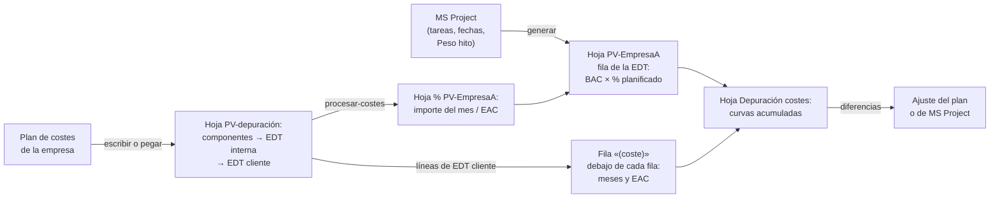
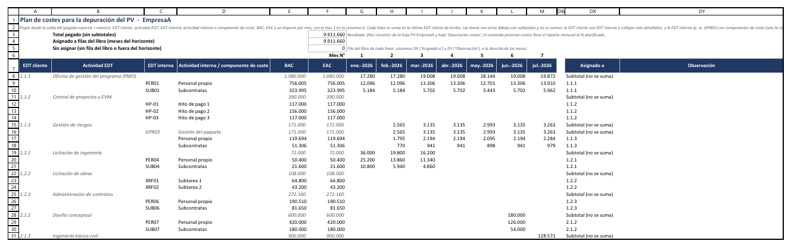
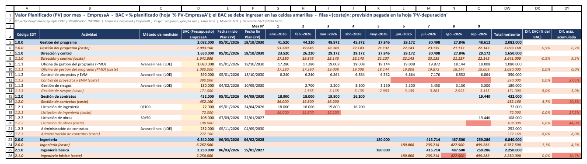
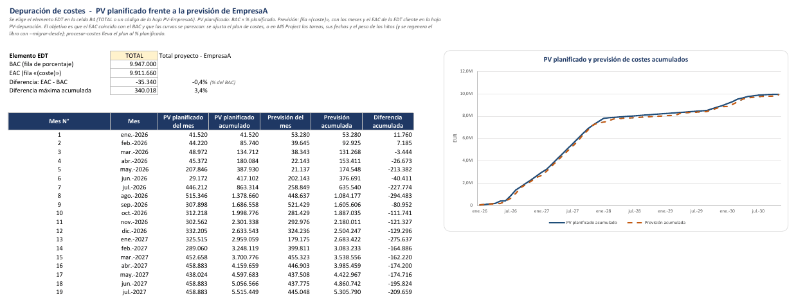
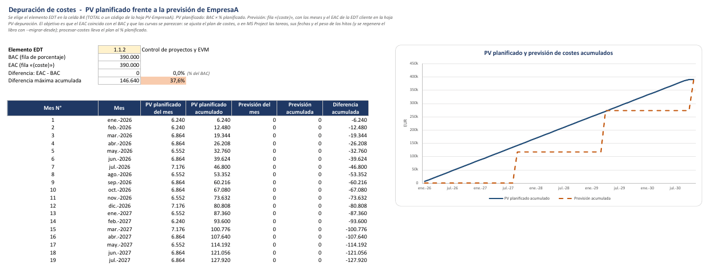

# Depuración de costes (opcional)

[Inicio](../README.md) › [Documentación](README.md) › Depuración de costes

La **depuración de costes** compara, paquete por paquete, el **PV planificado** de una empresa (BAC × %
planificado de MS Project) con la **previsión mensual de su plan de costes**. Sirve para ajustar el plan o
MS Project (las tareas, sus fechas y el peso de sus hitos) hasta que las dos curvas se parezcan. Con el
comando `procesar-costes`, el PV de la empresa pasa a ser el **importe de cada mes de su plan de costes**
([8](#8-pv-con-el-reparto-del-plan-de-costes-procesar-costes)).

Se activa solo mientras dura ese ajuste. Para los libros que se entregan y para las actualizaciones
mensuales posteriores, el libro se genera sin depuración (conserva el BAC y el PV del plan de costes).

---

## Contenido

1. [Cuándo usarla](#1-cuándo-usarla)
2. [Cómo funciona](#2-cómo-funciona)
3. [Configuración](#3-configuración)
4. [Hoja PV-depuración: la previsión pegada](#4-hoja-pv-depuración-la-previsión-pegada)
5. [Filas «(coste)» de la hoja PV](#5-filas-coste-de-la-hoja-pv)
6. [Indicador de alineamiento (opcional)](#6-indicador-de-alineamiento-opcional)
7. [Hoja Depuración costes: el gráfico](#7-hoja-depuración-costes-el-gráfico)
8. [PV con el reparto del plan de costes (procesar-costes)](#8-pv-con-el-reparto-del-plan-de-costes-procesar-costes)
9. [Ciclo de ajuste](#9-ciclo-de-ajuste)
10. [Validaciones y limitaciones](#10-validaciones-y-limitaciones)
11. [Preguntas frecuentes](#11-preguntas-frecuentes)

---

## 1. Cuándo usarla

- El cronograma de MS Project **no tiene importes** ([Cálculo del PV y el EV](calculo-pv-ev.md)), pero
  la empresa tiene un **plan de costes o precios** con el importe de cada mes y quiere que el PV del libro
  siga ese perfil.
- Al **preparar la línea base**: antes de aprobarla, se revisa que las fechas de las tareas y el peso de
  los hitos reflejen cuándo se ejecuta (y se cobra) cada parte del trabajo.
- En **multi-empresa**, cada empresa depura su parte por separado, una a la vez, sin compartir su plan de
  costes con la otra.

---

## 2. Cómo funciona


```mermaid
flowchart LR
    PC["Plan de costes<br/>de la empresa"] -- "escribir o pegar" --> PD["Hoja PV-depuración:<br/>componentes → EDT interna<br/>→ EDT cliente"]
    MSP["MS Project<br/>(tareas, fechas,<br/>Peso hito)"] -- "generar" --> PV["Hoja PV-EmpresaA<br/>fila de la EDT:<br/>BAC × % planificado"]
    PD -- "líneas de EDT cliente" --> CO["Fila «(coste)»<br/>debajo de cada fila:<br/>meses y EAC"]
    PV & CO --> G["Hoja Depuración costes:<br/>curvas acumuladas"]
    G -- "diferencias" --> AJ["Ajuste del plan<br/>o de MS Project"]
    PD -- "procesar-costes" --> PCT["Hoja % PV-EmpresaA:<br/>importe del mes / EAC"]
    PCT --> PV
```

- La empresa escribe o pega su **plan de costes** en la hoja `PV-depuración`, en tres niveles: **EDT
  cliente**, **EDT interna** y **componente de coste**, con el BAC, el EAC y un importe por mes. Las
  celdas amarillas son datos y las naranjas, cálculos.
- Los importes se suman hacia arriba: los componentes en su EDT interna, las EDT interna en su EDT
  cliente y cada EDT cliente en la de su código superior. Esos cálculos los hace la empresa con fórmulas,
  o `procesar-costes --calculos` ([4.3](#43-cálculos-del-plan-celdas-naranjas)).
- Solo se leen las **líneas de EDT cliente** cuyo código es el de una fila de ingreso de la hoja PV de la
  empresa. Con **fórmulas de Excel**, la fila **«(coste)»** de debajo de cada fila muestra los meses y el
  **EAC** de esa línea. Al cambiar el plan, el libro se actualiza al instante, sin ejecutar el programa.
- El BAC de cada fila se **ingresa a mano** en la columna D de la hoja PV de la empresa (celdas
  amarillas); la fila «(coste)» muestra el EAC en esa misma columna. El objetivo es que el EAC coincida con
  el BAC y que las dos curvas se parezcan.
- La hoja `Depuración costes` muestra las **dos curvas acumuladas** del elemento EDT elegido.
- Las filas «(coste)» **no forman parte** del PV, del EV ni de los indicadores: `actualizar`, `analizar`
  y el Cuadro de Mando dan los mismos resultados que en un libro sin depuración.
- Cuando el PV de la empresa debe seguir el reparto de su plan de costes, `procesar-costes` escribe en la
  hoja `% PV-EmpresaA` el importe de cada mes dividido por el EAC de su línea: el PV (BAC × %) reparte el
  BAC como el plan ([8](#8-pv-con-el-reparto-del-plan-de-costes-procesar-costes)).

---

## 3. Configuración

En la sección `[exportacion]` del archivo de configuración:

```toml
[exportacion]
depuracion_costes = true          # activa la depuración (por defecto, false)
depuracion_empresa = "EmpresaA"   # multi-empresa: empresa que se depura (empresa_a o empresa_b)
depuracion_alineamiento = true    # indicador de alineamiento (opcional; por defecto, false)
depuracion_umbral = 10            # % del BAC a partir del cual se resalta un mes (por defecto, 10)
depuracion_calculos = false       # procesar-costes escribe los cálculos del plan (por defecto, false)
```

| Clave | Por defecto | Uso |
|---|---|---|
| `depuracion_costes` | `false` | Agrega las hojas `PV-depuración` y `Depuración costes` y las filas «(coste)». |
| `depuracion_empresa` | `empresa_a` | En multi-empresa, la empresa que se depura: el valor de `empresa_a` o de `empresa_b` (sin distinguir mayúsculas). En un libro de una sola empresa se depura la hoja `PV` y la clave no se usa. Las filas «(coste)» solo están en la hoja de esa empresa. |
| `depuracion_alineamiento` | `false` | Columnas con la diferencia entre el EAC y el BAC y la diferencia máxima acumulada en las filas «(coste)», y resaltado de los meses fuera de umbral ([6](#6-indicador-de-alineamiento-opcional)). |
| `depuracion_umbral` | `10` | Umbral del indicador, en % del BAC de la fila (mayor que 0 y hasta 100). |
| `depuracion_calculos` | `false` | `true` = `procesar-costes` escribe siempre los cálculos del plan en la hoja `PV-depuración` ([4.3](#43-cálculos-del-plan-celdas-naranjas)). Para hacerlo una sola vez, se usa `procesar-costes --calculos`. |

Se recomienda usar un archivo de configuración aparte para la depuración (por ejemplo
`config_depuracion.toml`), para no generar por error un libro de entrega con depuración.

---

## 4. Hoja PV-depuración: la previsión pegada



### 4.1 Formato

La hoja tiene el mismo formato que el plan de costes de la empresa. Los datos se escriben o se pegan
**desde la celda A8** (con *Pegado especial > Valores* si vienen de otro libro):

| Columna | Contenido |
|---|---|
| A · EDT cliente | Código EDT del elemento en el cronograma (`2.3.4.1`). Es la clave con la que cada línea se lee en una fila del libro. |
| B · Actividad EDT | Descripción de la EDT cliente. |
| C · EDT interna | Código del concepto de coste interno de la empresa que corresponde a la EDT cliente: partidas, subtareas o hitos de pago, con códigos no numéricos (`GPR01`, `XRF01`, `HP-01`). Vacía en la línea de la EDT cliente y en las de componentes de coste. |
| D · Actividad interna / componente de coste | Descripción de la EDT interna o, en una línea sin código en C, el **componente de coste** de la EDT interna de arriba (`Costes indirectos`, `Otros`...). |
| E · BAC | En los componentes y en las EDT interna sin componentes, un dato; en la EDT interna con componentes, la suma de sus componentes; en la EDT cliente, el BAC de su fila de la hoja PV de la empresa. |
| F · EAC | La suma de los meses de la línea. |
| G en adelante | Importe de cada mes, del mes 1 al 120 (o hasta el último mes del horizonte, si tiene más). |

Ejemplo de una EDT cliente con una EDT interna y sus componentes de coste, y otra EDT interna sin
componentes (en negrita, los cálculos: celdas naranjas):

| A · EDT cliente | B · Actividad EDT | C · EDT interna | D · Actividad interna / componente | E · BAC | F · EAC | G · mes 1 | H · mes 2 | Se lee |
|---|---|---|---|---:|---:|---:|---:|---|
| `1.1.0` | Lanzamiento | | | **1.300** | **1.300** | **600** | **700** | Sí, en la fila `1.1.0` |
| | | `GPR00` | Gestión del lanzamiento | **1.000** | **1.000** | **500** | **500** | No: se suma en la EDT cliente |
| | | | Costes indirectos X | 700 | **700** | 350 | 350 | No: se suma en `GPR00` |
| | | | Otros | 300 | **300** | 150 | 150 | No: se suma en `GPR00` |
| | | `GPR05` | Infraestructura | 300 | **300** | 100 | 200 | No: se suma en la EDT cliente |

- Encima de cada columna de meses, el programa escribe el **N° de mes** y su **fecha**: el mes 1 del plan
  debe ser el mes 1 del libro (`[horizonte] mes_inicio`). Si el plan de costes empieza en otro mes, se
  pega el bloque de meses desplazado.
- Los meses posteriores al horizonte del libro tienen el encabezado gris: no forman parte del PV.
- Admite hasta **2.000 líneas** (filas 8 a 2007).
- El plan debe estar en la **misma base** que el BAC (por ejemplo, a precio de contrato).

### 4.2 Qué líneas se leen

| Línea | Columna `Asignado a` | Se lee |
|---|---|---|
| EDT cliente (código en A, nada en C ni en D) con el código de una fila de ingreso del libro (`2.1.3`). Los ceros finales no cuentan: `1.2` es `1.2.0` | El código de la fila | **Sí**: sus meses y su EAC van a la fila «(coste)», y `procesar-costes` los lleva al % planificado. |
| EDT cliente de un resumen del libro (`1.2.0`, con filas `1.2.1` y `1.2.2`) | `Resumen: suma de sus filas` (gris) | No: el libro suma las filas de sus códigos inferiores. |
| EDT cliente de un resumen sin ninguna línea de un código inferior que se lea | `Resumen sin detalle en el plan` (rojo) | No: su importe no llega a ninguna fila. Se debe detallar con las EDT cliente de las filas del libro. |
| EDT cliente más detallada que el libro (`1.2.2.9`), con la línea de un código superior que se lee | `Incluida en su EDT cliente superior` (gris) | No: su importe ya está en la línea superior (con los cálculos del plan). |
| EDT cliente sin fila del libro (`9.9`) | `Sin fila del libro` (rojo) | No. |
| EDT interna, componente de coste, línea vacía o solo con descripción | (vacía) | No: se suman en su EDT cliente con los cálculos del plan. |

- Una línea con algo en C o en D no es de EDT cliente, aunque repita el código en la columna A.
- Las filas «Otras tareas» (`-D`) del libro no tienen EDT cliente propia: no reciben el plan de costes.
- Si dos líneas de EDT cliente tienen el mismo código, se suman las dos (la columna `Observación` lo
  indica).

> Excel convierte en número un código como `1.10` (que queda `1.1`). Para evitarlo, la columna del código
> en el plan de costes debe tener formato de texto. Las columnas A y C de `PV-depuración` ya tienen
> formato de texto.

### 4.3 Cálculos del plan (celdas naranjas)

| Línea | E · BAC | F · EAC | Meses |
|---|---|---|---|
| Componente de coste (solo la columna D) | Dato | Suma de sus meses | Datos |
| EDT interna con componentes debajo | Suma de sus componentes | Suma de sus meses | Suma de sus componentes |
| EDT interna sin componentes | Dato | Suma de sus meses | Datos |
| EDT cliente | El de su fila de la hoja PV de la empresa (vacío si no tiene fila) | Suma de sus meses | Suma de sus EDT interna, de los componentes que tenga directamente y de las EDT cliente de sus códigos inferiores (`1.0.0` = `1.1.0` + `1.2.0`). Sin líneas debajo, datos. |

- Cada componente pertenece a la **última EDT interna de arriba** de la misma EDT cliente (o a la EDT
  cliente, si no tiene EDT interna), y cada EDT interna, a la **última EDT cliente de arriba**.
- La empresa hace estos cálculos con fórmulas. `procesar-costes --calculos` (o
  `depuracion_calculos = true`) los escribe por ella: fórmulas como `=SUM(G12:G15)` en las celdas
  naranjas y fondo amarillo en las de datos. Después las fórmulas se actualizan solas al cambiar los
  datos, sin volver a ejecutar el comando.
- Con los cálculos, una línea con solo la columna D debajo de una EDT cliente o interna es un componente:
  los meses de la línea de arriba pasan a ser su suma.

### 4.4 Controles

| Control | Dónde | Qué indica |
|---|---|---|
| **Leído en filas del libro** | Celda F3 | Suma de los meses del horizonte de las líneas de EDT cliente que se leen. |
| **Leído después del horizonte** | Celda F4 (en rojo si no es 0) | Importes de esas líneas en meses posteriores al horizonte: no forman parte del PV. |
| **Sin leer** | Celda F5 (en rojo si no es 0) | Importe de las EDT cliente sin fila del libro y de los resúmenes sin detalle en el plan. |
| **Asignado a** | Columna a la derecha de los meses (DX con 120 meses) | En cada línea de EDT cliente, la fila del libro que la lee o por qué no se lee ([4.2](#42-qué-líneas-se-leen)). |
| **Observación** | Columna siguiente (DY) | En las líneas que se leen: `EDT cliente repetida: se suman sus líneas`, `Importes fuera del horizonte del libro` o `Importes guardados como texto: no se suman`. |

El BAC y el EAC de cada línea no se comparan: el objetivo es que el plan reparta en el tiempo el BAC de
cada EDT cliente, y la hoja PV de la empresa los muestra uno debajo del otro.

---

## 5. Filas «(coste)» de la hoja PV



En la hoja PV de la empresa que se depura (`PV-EmpresaA`, `PV-EmpresaB` o, en un libro de una sola
empresa, `PV`), debajo de **cada fila de la EDT** y de la fila TOTAL va su fila
«(coste)», con fondo naranja claro:

| Fila | Meses | Columna D |
|---|---|---|
| Paquete de trabajo (fila de ingreso) | Los de su línea de EDT cliente en `PV-depuración`. | El **EAC** de esa línea, debajo del BAC de la fila. |
| Subtotal (nivel 1 y 2) y TOTAL | Suma de las filas «(coste)» de sus hijos. | Suma de sus hijos. |

- Las filas «(coste)» tienen un **nivel de esquema** propio: con el botón del último nivel del esquema
  (a la izquierda de los números de fila) se muestran u ocultan todas a la vez.
- En las demás hojas (`PV`, `% PV`, `EV`, `AC`, `Indicadores EDT`...), las filas que corresponden a las
  filas «(coste)» quedan **vacías y ocultas**: así cada fila de la EDT está en la misma posición en todas
  las hojas, como necesitan `actualizar` y `--migrar-desde`.
- Las filas «(coste)» son fórmulas: no se escriben a mano. El plan se cambia en `PV-depuración`.

---

## 6. Indicador de alineamiento (opcional)

Con `depuracion_alineamiento = true`, cada fila «(coste)» tiene dos columnas más, a la derecha de
`Total horizonte`:

| Columna | Cálculo |
|---|---|
| **Dif. EAC (% del BAC)** | (EAC de la fila «(coste)» − BAC de la fila) / BAC de la fila. |
| **Dif. máx. acumulada** | Mayor diferencia, en valor absoluto, entre la previsión acumulada y el PV planificado acumulado de algún mes, dividida por el BAC de la fila. |

Se resaltan en rojo:

- los **meses** de la fila «(coste)» en que la diferencia acumulada supera `depuracion_umbral` (por
  defecto, el 10 % del BAC de la fila);
- las dos columnas del indicador cuando superan el umbral.

Así se ve enseguida qué paquetes y qué meses hay que revisar en el plan o en MS Project. Las filas sin BAC
no tienen indicador.

---

## 7. Hoja Depuración costes: el gráfico



- En la celda **B4** (amarilla) se elige el elemento EDT: `TOTAL` (por defecto) o el código de cualquier
  fila del libro, con la lista desplegable. Sirve para ajustar **paquete por paquete**.
- Debajo: el BAC de la fila, el EAC de la fila «(coste)», su diferencia y la diferencia máxima acumulada
  (con su % del BAC, en rojo si supera `depuracion_umbral`).
- La tabla muestra, mes a mes, el PV planificado y la previsión, del mes y acumulados, y su diferencia
  acumulada. El gráfico muestra las dos curvas acumuladas.



En el ejemplo, el paquete `1.1.2` tiene el mismo BAC y EAC, pero la previsión son tres hitos de pago y el
PV planificado es casi lineal (una tarea continua de 2026 a 2030): la diferencia acumulada llega al
37,6 % del BAC. Para alinearlo, se agregan en MS Project hitos con su `Peso hito` en esos meses, se
acepta la diferencia si el PV debe seguir el avance del trabajo y no los pagos, o se lleva el plan al PV
con `procesar-costes`.

> El gráfico abarca hasta el último mes con PV planificado o con previsión. Si después se escribe un plan
> más largo, el gráfico se amplía al ejecutar `analizar`, `actualizar` o `procesar-costes`, o al regenerar
> el libro.

---

## 8. PV con el reparto del plan de costes (procesar-costes)

Cuando el PV de la empresa debe seguir el reparto en el tiempo de su plan de costes, y no el que resulta
de las tareas de MS Project, el comando `procesar-costes` lleva ese reparto al % planificado:

```powershell
python evm_export.py procesar-costes --libro EVM_Depuracion.xlsx
python evm_export.py procesar-costes --libro EVM_Depuracion.xlsx --calculos    # escribe antes los cálculos
```

- Con `--calculos` (o `depuracion_calculos = true`), primero escribe en `PV-depuración` las fórmulas de
  los cálculos del plan ([4.3](#43-cálculos-del-plan-celdas-naranjas)). Sin esa opción, usa los importes
  que tiene la hoja.
- Lee las **líneas de EDT cliente** con el código de una fila de ingreso de la hoja PV de la empresa
  ([4.2](#42-qué-líneas-se-leen)): la **EDT cliente** es la clave.
- En la hoja `% PV-EmpresaA` (o `% PV` en un libro de una sola empresa), el % planificado de cada mes de
  la fila es el **importe del mes dividido por el EAC de su línea** (la suma de sus meses, también los
  posteriores al horizonte). Los meses procesados se muestran en cursiva naranja.
- Así, la fila suma 100 % y el PV (**BAC × %**) **reparte el BAC como el plan**, en todas las hojas y en
  los indicadores. Con el EAC igual al BAC, el PV de cada mes es el importe del plan.
- Si el EAC no coincide con el BAC, el PV sigue terminando en el BAC: la diferencia se ve en la fila
  «(coste)», que muestra los importes del plan y su EAC, y en el gráfico. El PV debe terminar en el BAC
  porque el EV también termina en él (BAC × % ganado): si el PV terminara en el EAC, un proyecto al día
  tendría un SPI distinto de 1 todos los meses. Un sobrecoste previsto se refleja en el EAC, no en el PV.
- El % no depende del BAC: si el BAC se ingresa o cambia después, el PV se ajusta solo, sin volver a
  ejecutar `procesar-costes`.
- Las filas sin línea en el plan, con la línea sin importes o con el EAC cero o negativo (p. ej. abonos
  que anulan los cargos), y las de la otra empresa, conservan su % planificado.
- Si el plan de una fila empieza después del mes de comienzo de su línea base o termina antes del mes de
  su fin, se informa ([DEP-021](codigos.md#dep-021)): si al plan le faltan meses, el PV no sigue el
  cronograma. Se completa el plan o se revisan las fechas en MS Project.
- No lee MS Project: se puede ejecutar cada vez que cambia el plan. Con `--simular` muestra el resultado
  sin modificar el libro.

| Ejemplo (fila `1.1.0`, BAC 150) | Mes 1 | Mes 2 | Mes 3 | Total |
|---|---:|---:|---:|---:|
| Plan de costes: línea de EDT cliente (EAC 157) | 31 | 30 | 39... | 157 |
| % planificado (importe / EAC) | 19,7 % | 19,1 % | 24,8 %... | 100 % |
| PV (BAC × %) | 29,6 | 28,7 | 37,3... | 150 |

Mientras se depura el plan, `procesar-costes` se ejecuta de nuevo cada vez que el plan cambia. Una vez
fijada la línea base, procesar una nueva previsión del plan cambia el PV: se recomienda hacerlo solo con
los cambios aprobados.

Las filas procesadas quedan marcadas en el libro, y su % planificado:

- **se conserva** al regenerar el libro con `--migrar-desde`, también en el libro de entrega sin
  depuración. La hoja `Validación` lo indica ([DEP-010](codigos.md#dep-010)). Si cambió el mes 1 del
  horizonte, cada mes conserva su fecha; lo anterior al nuevo mes 1 se suma en el mes 1;
- **no se compara** con la línea base de MS Project en `actualizar` (el aviso
  [ACT-047](codigos.md#act-047) solo revisa las demás filas). El % ganado se sigue calculando con el avance
  de MS Project.

Para volver a calcular el % planificado de esas filas con MS Project, se genera el libro sin
`--migrar-desde` y se cargan de nuevo el BAC y el AC, o se usa el respaldo del libro anterior a
`procesar-costes`.

> Con el plan de costes, el PV de cada mes sigue el plan y el EV sigue el avance de las tareas. Si el plan
> no sigue la ejecución del trabajo (por ejemplo, si son hitos de pago), el SV y el SPI miden también esa
> diferencia. Por eso conviene revisar antes las dos curvas en `Depuración costes`.

---

## 9. Ciclo de ajuste

1. **Generar el libro de depuración**, con la configuración de depuración:

   ```powershell
   python evm_export.py generar --origen "C:\Programa\Programa.mpp" --config config_depuracion.toml `
       --salida EVM_Depuracion_v1.xlsx
   ```

2. **Ingresar el BAC** de cada fila en la columna D de la hoja PV de la empresa (celdas amarillas).
3. **Escribir o pegar el plan de costes** en `PV-depuración`, desde la celda A8, con sus cálculos (o
   ejecutar `procesar-costes --calculos`), y revisar los controles: `Sin leer` debe ser 0 y la columna
   `Asignado a` no debe tener líneas en rojo.
4. **Comparar** en `Depuración costes`, empezando por `TOTAL` y siguiendo con los paquetes de mayor
   diferencia (o con el indicador de alineamiento de la hoja PV).
5. **Ajustar** el plan de costes (para que el EAC de cada fila se acerque a su BAC) o MS Project: fechas y
   duraciones de las tareas, hitos y su `Peso hito`, división de tareas (ver
   [% planificado: peso de cada tarea](calculo-pv-ev.md#4--planificado-peso-de-cada-tarea)). El %
   planificado se calcula con las **fechas de la línea base**: después de cambiar las fechas, se debe
   volver a guardar la línea base de las tareas modificadas.
6. **Regenerar** el libro con `--migrar-desde` si cambió MS Project. Conserva el BAC y el contenido de
   `PV-depuración` (y vuelve a escribir las fórmulas de los cálculos del plan):

   ```powershell
   python evm_export.py generar --origen "C:\Programa\Programa.mpp" --config config_depuracion.toml `
       --salida EVM_Depuracion_v2.xlsx --migrar-desde EVM_Depuracion_v1.xlsx
   ```

   Se repiten los pasos 4 a 6 hasta que las curvas queden alineadas.
7. **Aprobar la línea base** ajustada, según el [proceso de reporte](proceso-reporte-evm.md#5-cambios-de-línea-base).
   Si el PV de la empresa debe ser el de su plan de costes, se ejecuta `procesar-costes`
   ([8](#8-pv-con-el-reparto-del-plan-de-costes-procesar-costes)).
8. **Generar el libro de entrega** sin depuración (`depuracion_costes = false`, por ejemplo con el
   `config.toml` habitual) y con `--migrar-desde`, que conserva el BAC y el % planificado del plan de
   costes:

   ```powershell
   python evm_export.py generar --origen "C:\Programa\Programa.mpp" --config config.toml `
       --salida EVM_Programa.xlsx --migrar-desde EVM_Depuracion_v2.xlsx
   ```

   El libro nuevo no tiene `PV-depuración` ni filas «(coste)»: la hoja `Validación` indica que el plan no
   se trasladó. Desde ahí sigue el
   [cierre mensual](calculo-pv-ev.md#12-puesta-en-marcha-y-cierre-mensual) habitual.

Sobre `--migrar-desde` en la depuración:

- El plan de costes se traslada solo si el libro nuevo también tiene depuración **de la misma empresa**;
  si no, la hoja `Validación` lo indica y se debe escribir de nuevo.
- Las celdas con fórmula pasan con su valor, y las fórmulas de los cálculos del plan se vuelven a
  escribir en el libro nuevo.
- Si cambió el mes 1 del horizonte, los meses de `PV-depuración` se desplazan para conservar su fecha;
  lo que queda antes del mes 1 se informa en `Validación`.
- Las líneas se leen de nuevo con los códigos EDT del libro nuevo, aunque la EDT haya cambiado.
- Si el libro anterior tiene la hoja sin la columna EAC (versión 2.4: meses desde la columna F), se
  agrega con la suma de los meses de cada línea. Si tiene la hoja sin las columnas de EDT interna
  (código, descripción, BAC y meses desde la columna D), el plan se pasa al formato actual: los
  códigos numéricos quedan como EDT cliente y los demás (`XRF01`), como EDT interna.

---

## 10. Validaciones y limitaciones

| Mensaje en `Validación` | Significado |
|---|---|
| `Depuración de costes de EmpresaA: se debe pegar la previsión...` (Info) | Recordatorio de la hoja que se depura y de generar el libro de entrega sin depuración. |
| `... filas tienen código EDT no numérico ... no pueden recibir la previsión` (Advertencia) | Las filas con códigos como `INTERNO` o `A1` no se pueden leer: el plan solo se asocia por códigos numéricos. |
| `códigos EDT repetidos en el libro ...` (Advertencia) | Un código está en dos filas: el plan se lee en la primera. |
| `Se conservó el contenido de la hoja PV-depuración ...` (Info) | `--migrar-desde` trasladó el plan (y volvió a escribir las fórmulas de los cálculos, si las tenía). |
| `La hoja PV-depuración del libro anterior tenía el formato sin EDT interna ...` (Info) | El plan trasladado se pasó al formato con las columnas de EDT interna. |
| `La hoja PV-depuración del libro anterior no tenía la columna EAC ...` (Info) | El plan trasladado se pasó al formato con la columna EAC. |
| `La hoja PV-depuración del libro anterior ... no se trasladó` (Info o Advertencia) | El libro nuevo no tiene depuración, o depura otra empresa. |
| `Se conservó el reparto del plan de costes (procesar-costes) en ... filas ...` (Info o Advertencia) | `--migrar-desde` conservó el % planificado del plan de costes. |
| `Reúne varias filas del libro anterior con el reparto del plan de costes ...` (Advertencia) | La fila nueva junta varias filas procesadas (p. ej. al bajar el nivel máximo): su % planificado vuelve a ser el de MS Project. |

`procesar-costes` informa en la consola las líneas de EDT cliente sin leer, los importes después del
horizonte, las filas sin línea en el plan, sin importes o con el EAC cero o negativo, las EDT cliente
repetidas, los importes guardados como texto y las filas cuyo plan no cubre los meses de su línea base
([DEP-012 a DEP-021](codigos.md#413-dep--depuración-de-costes)).

Limitaciones:

- Una empresa a la vez: para depurar la otra, se genera otro libro con `depuracion_empresa`.
- El libro de depuración pesa más (unas 24.000 fórmulas de lectura en una hoja oculta) y tarda unos
  segundos más en calcularse.
- Las filas «(coste)» y las hojas `Depuración costes` y la oculta `_depuracion` no se deben modificar: son
  fórmulas. En `PV-depuración`, solo la zona del plan (desde la fila 8, hasta la columna del último mes).

---

## 11. Preguntas frecuentes

**¿La depuración cambia el PV o el EV del libro?** No. Las filas «(coste)» solo se comparan con el PV
planificado; los indicadores, el Cuadro de Mando y `actualizar` usan las mismas filas que un libro sin
depuración. El PV solo cambia si se ejecuta `procesar-costes`, que lleva el plan de costes al %
planificado.

**¿Por qué se lee solo la línea de la EDT cliente?** Porque es la que trae el total de sus EDT interna y
componentes (los cálculos del plan). Leer también esas líneas contaría dos veces el mismo importe.

**¿Hay que hacer coincidir el BAC y el EAC?** Es el objetivo, pero el programa no los compara. Con
`procesar-costes`, el PV de la fila reparte su BAC como el plan: el total del PV es el BAC aunque el EAC
no coincida, y la diferencia se ve en la fila «(coste)» (columna D) y en el gráfico.

**¿Se pueden cargar los cierres mensuales en el libro de depuración?** Sí, `actualizar` y `analizar`
funcionan igual. Pero el libro muestra el plan de costes de la empresa: para entregar o compartir el
libro, se genera sin depuración.

**¿Y si el plan de costes tiene más detalle que el libro?** Las EDT cliente más detalladas se suman en
la de su código superior con los cálculos del plan (`2.3.4.1.5` en `2.3.4.1`), que es la que se lee. Si
el libro tiene menos filas que el plan, también se puede generar con `lista_edt` para que tenga una fila
por EDT cliente del plan.

**¿Se puede depurar con un libro de una sola empresa?** Sí: se depura la hoja `PV`.

**¿Cómo se prueba la función sin un proyecto real?** Con el [proyecto de ejemplo](ejemplo-paso-a-paso.md):
se genera el libro multi-empresa con `depuracion_costes = true` y se ejecuta
`python ejemplos\generar_ejemplo.py --libro EVM_Depuracion.xlsx`, que escribe el BAC de cada fila y un
plan de costes ficticio de EmpresaA en `PV-depuración`: cada EDT cliente con sus líneas de EDT interna
(personal propio y subcontratas, hitos de pago, subtareas o una EDT interna con sus componentes de
coste), con algunos meses desplazados, y las EDT cliente de los resúmenes. Después se puede probar
`procesar-costes` con ese libro.
